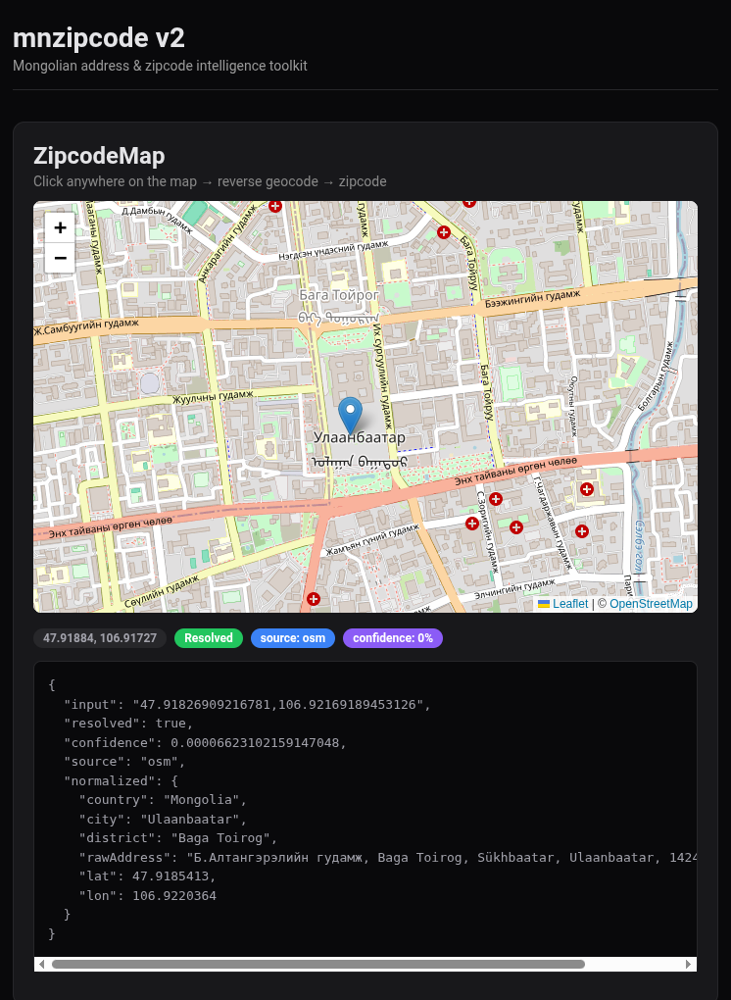

<h1 align="center">
  <br />
  mnzipcode
  <br />
</h1>

<p align="center">
  <strong>Mongolian address & zipcode intelligence toolkit</strong>
  <br />
  Offline lookup &middot; fuzzy search &middot; OSM geocoding &middot; hybrid resolver &middot; interactive map
  <br /><br />
  <a href="https://www.npmjs.com/package/mnzipcode"></a>
  <a href="https://www.npmjs.com/package/mnzipcode"></a>
  <a href="https://bundlephobia.com/package/mnzipcode"></a>
  
  <a href="https://github.com/bekkaze/mnzipcode/blob/main/LICENSE"></a>
</p>

<p align="center">
  
</p>

---

## Features

- **Offline-first** — 2600+ zipcodes built in, no API keys, no network required
- **Fuzzy search** — Cyrillic & Latin, typo-tolerant
- **Autocomplete** — prefix-biased suggestions for search UIs
- **OSM geocoding** — optional forward & reverse geocoding via Nominatim
- **Hybrid resolver** — local dataset + OSM fallback with confidence scoring
- **React hooks** — `useZipcodeSearch`, `useResolveAddress`, `useReverseGeocode`
- **Map component** — drop-in `<ZipcodeMap />` with click-to-resolve
- **TypeScript** — full type definitions
- **ESM + CJS** — works everywhere

## Install

```bash
npm install mnzipcode
```

## Quick Start

```ts
import { lookup, isValid, search, suggest, resolve } from 'mnzipcode'

lookup('11000')
// → { resolved: true, zipcode: '11000', source: 'local', confidence: 1,
//     normalized: { country: 'Mongolia', city: 'Ulaanbaatar' } }

isValid('11000') // true
isValid('99999') // false

search('Баянзүрх')
// → [{ zipcode: '13000', normalized: { city: 'Ulaanbaatar', district: 'Bayanzurkh' }, ... }]

suggest('Дор', { limit: 3 })
// → [{ name: 'Dornod', zipcode: '21000' }, { name: 'Dornogovi', zipcode: '44000' }, ...]

await resolve('Сүхбаатар дүүрэг', { mode: 'hybrid' })
// → { resolved: true, zipcode: '14000', source: 'hybrid', confidence: 0.9, ... }
```

---

## API Reference

### Core (offline)

#### `lookup(zipcode)`

Exact zipcode lookup. Returns `ResolveResult | null`.

```ts
lookup('12001')
// → { zipcode: '12001', normalized: { country: 'Mongolia', city: 'Ulaanbaatar',
//     district: 'Baganuur', subdistrict: 'Хэрлэн голын хөвөө-1' } }

lookup(21000)   // numeric input works
lookup('99999') // null
```

#### `isValid(zipcode)`

Returns `true` if the zipcode exists in the dataset.

#### `search(query, options?)`

Fuzzy search across all Cyrillic and Latin names.

```ts
search('Баянзүрх', { limit: 5 })
search('Dornod')
search('Дорнот')  // typo-tolerant
```

| Option  | Type     | Default | Description |
| ------- | -------- | ------- | ----------- |
| `limit` | `number` | `10`    | Max results |

#### `suggest(query, options?)`

Prefix-biased autocomplete suggestions.

```ts
suggest('Дор', { limit: 3 })
// → [{ name: 'Dornod', zipcode: '21000', confidence: 0.9 }, ...]
```

---

### OSM Geocoding (optional)

Forward and reverse geocoding via [Nominatim](https://nominatim.org/). Opt-in — only called when you use them.

#### `geocode(query, options?)`

```ts
import { geocode } from 'mnzipcode'

await geocode('Ulaanbaatar', { userAgent: 'my-app/1.0' })
// → { resolved: true, source: 'osm', normalized: { city: 'Ulaanbaatar', lat: 47.9212, lon: 106.9057 } }
```

#### `reverse(lat, lon, options?)`

```ts
import { reverse } from 'mnzipcode'

await reverse(47.9212, 106.9057)
// → { resolved: true, source: 'osm', normalized: { city: 'Ulaanbaatar', district: 'Sukhbaatar' } }
```

#### OSM Options

| Option        | Type      | Default          | Description               |
| ------------- | --------- | ---------------- | ------------------------- |
| `endpoint`    | `string`  | Nominatim public | Custom Nominatim instance |
| `userAgent`   | `string`  | `mnzipcode/2.0`  | User-Agent header         |
| `cache`       | `boolean` | `true`           | In-memory caching         |
| `cacheTTL`    | `number`  | `3600000`        | Cache TTL in ms (1h)      |
| `countryCode` | `string`  | `mn`             | Country filter            |

---

### Hybrid Resolver

Combines local dataset + OSM into one unified call with confidence scoring.

#### `resolve(input, options?)`

```ts
import { resolve } from 'mnzipcode'

await resolve('11000', { mode: 'local' })    // offline, instant
await resolve('Peace Avenue', { mode: 'osm' }) // OSM only
await resolve('Баянзүрх', { mode: 'hybrid' }) // local first, OSM fallback
```

**How hybrid mode works:**

```
Input
 ├─ looks like zipcode? → exact lookup → done
 ├─ fuzzy search local → confident match? → done
 ├─ fall back to OSM geocoding
 ├─ cross-reference with local data for zipcode
 └─ return unified result with source: 'hybrid'
```

| Option           | Type                               | Default    |
| ---------------- | ---------------------------------- | ---------- |
| `mode`           | `'local'` \| `'osm'` \| `'hybrid'` | `'hybrid'` |
| `osm`            | `OsmOptions`                       | —          |
| `fuzzyThreshold` | `number`                           | `0.6`      |

---

### Output Schema

Every function returns a consistent `ResolveResult`:

```ts
interface ResolveResult {
  input: string
  resolved: boolean
  zipcode?: string
  confidence: number       // 0–1
  source: 'local' | 'osm' | 'hybrid'
  normalized?: {
    country?: string
    city?: string
    district?: string
    subdistrict?: string
    khoroo?: string
    aimag?: string         // province
    soum?: string          // sub-province
    lat?: number
    lon?: number
    rawAddress?: string
  }
  candidates?: Array<{
    name: string
    zipcode?: string
    source: 'local' | 'osm'
    confidence: number
  }>
}
```

---

## React / Next.js

Optional hooks and components via subpath imports. **React is not required for the core package.**

```bash
npm install mnzipcode react
```

### `useZipcodeSearch`

Debounced offline search for building search UIs.

```tsx
import { useZipcodeSearch } from 'mnzipcode/react'

function ZipcodeSearch() {
  const [query, setQuery] = useState('')
  const { results, isSearching } = useZipcodeSearch(query, { debounceMs: 300, limit: 10 })

  return (
    <div>
      <input value={query} onChange={(e) => setQuery(e.target.value)} placeholder="Search..." />
      {results.map((r) => (
        <div key={r.zipcode}>{r.zipcode} — {r.normalized?.district}</div>
      ))}
    </div>
  )
}
```

### `useResolveAddress`

Hybrid resolver with loading and error states.

```tsx
import { useResolveAddress } from 'mnzipcode/react'

function AddressResolver() {
  const [input, setInput] = useState('')
  const { result, isLoading, error } = useResolveAddress(input, { mode: 'hybrid' })

  return (
    <div>
      <input value={input} onChange={(e) => setInput(e.target.value)} />
      {result?.resolved && <p>Zipcode: {result.zipcode} ({result.confidence * 100}%)</p>}
    </div>
  )
}
```

### `useReverseGeocode`

Coordinates to address + zipcode. Triggers when coordinates change.

```tsx
import { useReverseGeocode } from 'mnzipcode/react'

function MapClickResult() {
  const [coords, setCoords] = useState(null)
  const { result, isLoading } = useReverseGeocode(coords?.lat ?? null, coords?.lon ?? null)

  // On map click → setCoords({ lat, lon })
  // result.zipcode → resolved zipcode
}
```

---

## Map Component

Drop-in interactive map with click-to-resolve. Requires `leaflet` and `react-leaflet` as peer dependencies.

```bash
npm install mnzipcode leaflet react-leaflet
```

```tsx
import { ZipcodeMap } from 'mnzipcode/map'
import 'leaflet/dist/leaflet.css'

function App() {
  return (
    <ZipcodeMap
      height={500}
      zoom={12}
      center={[47.92, 106.91]}
      onResolve={(result, coords) => {
        console.log(result.zipcode, result.normalized)
      }}
    />
  )
}
```

Click anywhere on the map → reverse geocode → zipcode + structured address.

### `<ZipcodeMap />` Props

| Prop              | Type                          | Default      | Description                    |
| ----------------- | ----------------------------- | ------------ | ------------------------------ |
| `height`          | `string \| number`            | `'400px'`    | Map height                     |
| `width`           | `string \| number`            | `'100%'`     | Map width                      |
| `center`          | `[number, number]`            | Mongolia     | Initial center `[lat, lon]`    |
| `zoom`            | `number`                      | `6`          | Initial zoom level             |
| `className`       | `string`                      | —            | CSS class for wrapper div      |
| `style`           | `CSSProperties`               | —            | Inline style for wrapper       |
| `mapClassName`    | `string`                      | —            | CSS class for map container    |
| `mapStyle`        | `CSSProperties`               | —            | Inline style for map           |
| `tileUrl`         | `string`                      | OSM default  | Custom tile URL                |
| `tileAttribution` | `string`                      | OSM          | Tile attribution               |
| `onResolve`       | `(result, coords) => void`    | —            | Called when location resolved   |
| `onClick`         | `(coords) => void`            | —            | Called on map click             |
| `renderPopup`     | `(result, loading, coords) => ReactNode` | — | Custom popup content |
| `markerIcon`      | `L.Icon`                      | Default pin  | Custom marker icon             |
| `disabled`        | `boolean`                     | `false`      | Disable click interaction      |

### With react-leaflet (manual)

If you prefer full control over the map instead of `<ZipcodeMap />`:

```tsx
import { MapContainer, TileLayer, useMapEvents, Marker, Popup } from 'react-leaflet'
import { useReverseGeocode } from 'mnzipcode/react'

function LocationPicker() {
  const [coords, setCoords] = useState(null)
  const { result } = useReverseGeocode(coords?.lat ?? null, coords?.lon ?? null)

  function ClickHandler() {
    useMapEvents({ click(e) { setCoords({ lat: e.latlng.lat, lon: e.latlng.lng }) } })
    return null
  }

  return (
    <MapContainer center={[47.92, 106.91]} zoom={12} style={{ height: 400 }}>
      <TileLayer url="https://{s}.tile.openstreetmap.org/{z}/{x}/{y}.png" />
      <ClickHandler />
      {coords && (
        <Marker position={[coords.lat, coords.lon]}>
          <Popup>{result?.normalized?.rawAddress}</Popup>
        </Marker>
      )}
    </MapContainer>
  )
}
```

---

## Package Exports

| Import             | What you get                                  | Requires           |
| ------------------ | --------------------------------------------- | ------------------- |
| `mnzipcode`        | Core: `lookup`, `isValid`, `search`, `suggest`, `resolve`, `geocode`, `reverse` | — |
| `mnzipcode/react`  | Hooks: `useZipcodeSearch`, `useResolveAddress`, `useReverseGeocode` | `react` |
| `mnzipcode/map`    | Component: `<ZipcodeMap />`                   | `react`, `leaflet`, `react-leaflet` |

All peer dependencies are **optional** — install only what you use.

---

## CommonJS

```js
const { lookup, isValid, search } = require('mnzipcode')

lookup('11000')
isValid('21000')
search('Dornod')
```

---

## Dataset

**2600+ Mongolian zipcodes** covering all administrative levels:

| Level             | Examples                             | Count |
| ----------------- | ------------------------------------ | ----- |
| Capital & Aimags  | Ulaanbaatar, Dornod, Khentii        | 22    |
| Districts & Soums | Bayanzurkh, Baganuur, Khalkhgol     | 340+  |
| Sub-areas & Bags  | Villages, neighborhoods, settlements | 2200+ |

Structure: `Province/Capital > District/Soum > Sub-area`

Each entry includes Cyrillic name. Top-level entries include Latin transliteration.

---

## Contributing

```bash
git clone https://github.com/bekkaze/mnzipcode.git
cd mnzipcode
npm install
npm test
npm run build
```

## License

[ISC](https://github.com/bekkaze/mnzipcode/blob/main/LICENSE)
